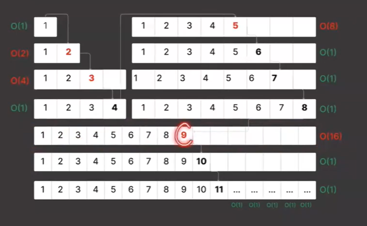

Time - 5th Feb - 11th Feb.

Topic 
- Time Complexity.
- ArrayList.
- Array Practice 1.
- Array Practice 2.
- Doubt Clearing Classes.

**In one second there can be $2*10^{8}$ operations.**
Say N is $10^{5}$ then  O($N^{2}$) is O($10^{10}$)

- So one operation will take $\frac{10^{10}}{2*10^{8}}$ secs/

= $\frac{100*10^{8}}{2*10^{8}}$ 

= 50 secs.

Generally one operation should take around 2 secs. %0 sec is not allowed we need to optimise the solution.

### Time Complexity.

When we do any program time complexity does not signofies the time taken for the program to run as it depends on the os, language and the input given.

- Time complexity is measured as the number of instruction performed. 
- Example. Sum of first 5 natural number. One way of doing it is $\frac{n*(n+1)}{2}$ anotehr wauis using for loop and adding the value. 
- For n=5 the formula will work for one time and the loop will work for 5 time. So the first one is optimized. With for loop with more value of n time will grow more O(n) mean linear time complexity.
- The formula method is O(1) constant time.

| Notation | Value                                            |
|----------|--------------------------------------------------|
| Big O    | Upper Bound. Function cannot go more than this.  |
| Omega    | Lower Bound. Function cannot go less than this.  |
| Theta    | Exact.                                           |

In 1 sec nearly $2*10^{8}$ instruction can be done.

### Array Practice 1.

When we create and array of size 10 then when we insert the 11 element then the entire array get copied in an array of size 20. 

- When tha size of the array is 8 and the capacity if the array is 8 adding new element then copy the entire array to a new array. Time is O(N). So the time is O(16).

- We creaeda a new array of 2*cap size + cap (to add the element) = 3*cap. We have to do 3*N steps.

When there is a cap size we just insert element O(1) else it is $2^{i}$

Total time taken.

{1+1+1+1+1+...1} + 3*($2^{0} + 2^{1} + 2^{2} + 2^{3}...$)

The 3() val <= logN. 1+1...+1 <=N

= N + 3($\frac{$2^{0}$ * 2^{logN}-1}{2-1}$)

= N + 3($2^{logN}-1}$)

= N + 3*(N - 1)

 = 4*N - 3.
 
Total time = 4N-3.

Average Time per operation = $\frac{4N-3}{N}$

= 4-(3/N) = <4 = O(N).

Solved two problem 
- Max consecutive ones. https://leetcode.com/problems/max-consecutive-ones/
- Max sum subarray of size k. https://www.geeksforgeeks.org/problems/max-sum-subarray-of-size-k5313/1

### Array Practice 2

- Merge two sorted array - By taking another array and sort it. Optimized Two pointer approach.
- Prefix Sum.
- Prefix Max Array. (Same).
- Given an array and M queries and each queries will have an index i, we need to find max of all array elements except a[i]

arr[] = {2,1,3,5,4,5,7,6} N = 8 and M = 4. Now M queries are 4,7,6,3.

In first case we need to find the max element in array except the index 4.
O/P = 7,7,6,7 (0 based index).

