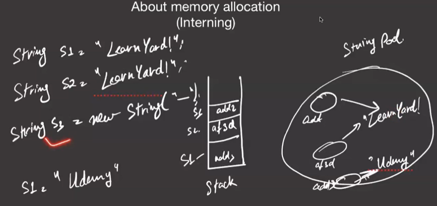

https://codeforces.com/problemset/problem/112/A
https://leetcode.com/problems/reverse-string/description/
https://codeforces.com/problemset/problem/977/B
https://leetcode.com/problems/palindrome-number/description/ (Try converting to string)
https://leetcode.com/problems/valid-palindrome/description/
https://leetcode.com/problems/valid-palindrome-ii/description/ (Good one)

Stores string in string pool. If the string is same then the address will be same. 
 

If the string is created with the `new` keyword then the address will be different for the same value.
If we do not use the new keyword address is same for the string with sme value.
- So we cannot change the string value as many other string will refer to the same address.
- String is Immutable.

**Reference is mutable but the instance is immutable.**

```java
String str = "Hello";
String str1 = "Hello";
// The address of str and str1 is same. If we make change in hello and str it will point to the new address.
```


**StringBuilder.**