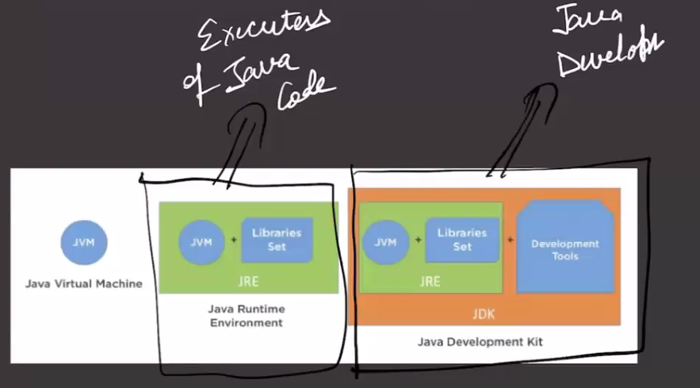

In Inheritance we have super class `Vehicle` and sub class `Car`. When making an object of `Car` then first the default constructor of the parent will be called then the constructor of the subclass.

Inside the constructor we can pass the value like `this.make = make`. Now when we make the constructor of the `Car` we can make using the this keyword or else we can make with the `super(make,model)`

---

When we create a Shape class we donot want to make an object of the Space class. We need to implement the rectangle or circle. We can create an object of rectangle, circle.

When we donot want to create an object of one class then we make the class in abstract.

Abstract method can be only inside an abstract class. Abstract method has no implementation. Once declare an abstract method, the subclass of the class should have the implementation of the abstract method.

---

Java is hybrid(compiled and interpreted). 
Main.java ->(compiled) (javac compiler) -> converts to main.class. This is bytecode.

Bytecode runs inside JVM. Java Virtual Machine is a software runs inside the OS. JVM acts like a bridge between the code and OS.

It is not directly changed to the machine code. It is changed to the bytecode so that it is Platform Independent.

JVM runs the bytecode in an interpreted manner. First it is compiled to make the bytecode then it is interpreted by the JVM.

One of the development kit is like the compiler.